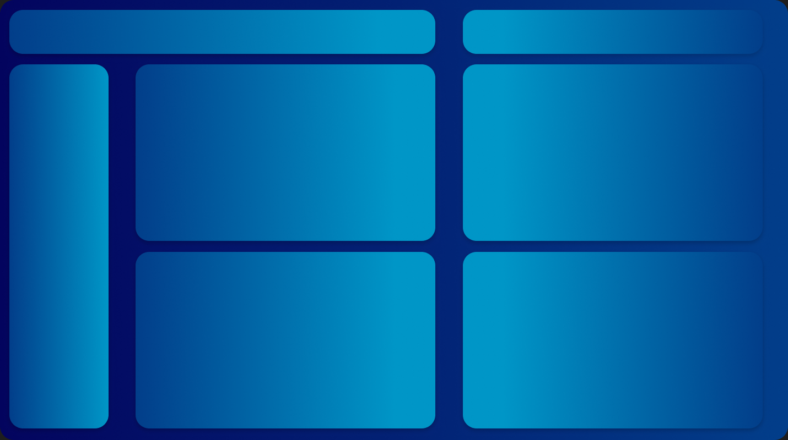

# Performance Tracking Dashboard — Power BI

A business intelligence dashboard built to track global sales performance across categories, subcategories, countries, and order priorities.

---

## Overview

This project was built as a hands-on exercise to apply core BI skills end-to-end: data import, data modeling, DAX measures, visual design, and theme customization in Power BI.

The dataset simulates a retail company's order data across multiple countries, customer segments, and product categories — similar to the well-known Superstore dataset format.

---

## Dashboard Preview

---

## Key Visuals

- **KPI Cards** — Total Sales (12.64M), Total Discount (7.33M), Total Profit (1.47M)
- **Bar Chart** — Average Discount by Subcategory
- **Pie Chart** — Order Count by Category (Supplies, Technology, Furniture)
- **Map** — Average Total Sales by Country (bubble map, dark theme)
- **Stacked Bar Chart** — Order Count by Country and Priority (High, Low, Critical, Medium) with semantic color coding

---

## Filters

- Year (2011–2014)
- Customer Segment (Consumer, Corporate, Home Office)
- Country

---

## Tech Stack

| Tool | Usage |
|---|---|
| Power BI Desktop | Dashboard development, DAX, Power Query |
| CSV / Excel | Data source |
| Figma / PowerPoint | Custom background design |

---

## Files

| File | Description |
|---|---|
| `Primeiro Projeto de BI.pbix` | Main Power BI file |
| `dataset.csv` | Raw dataset (CSV format) |
| `dataset.xlsx` | Raw dataset (Excel format) |
| `BackGround.png` | Custom background image |

---

## What I Practiced

- Importing and transforming data with Power Query
- Building calculated measures with DAX
- Designing a cohesive visual theme with a custom color palette
- Applying semantic color coding to encode meaning (e.g., red = critical priority)
- Creating a custom background in PowerPoint and applying it to Power BI
- Map visualization with bubble sizing by value

---

## Author

**Pedro Barbosa**
Data Analyst | Python • SQL • Power BI • ETL • Data Visualization | C1 English

[LinkedIn](https://linkedin.com/in/pedrobarbosafreire) • [GitHub](https://github.com/pedrobarbosa)

---

## License

This project uses a synthetic dataset for learning purposes only. No real business data is included.
